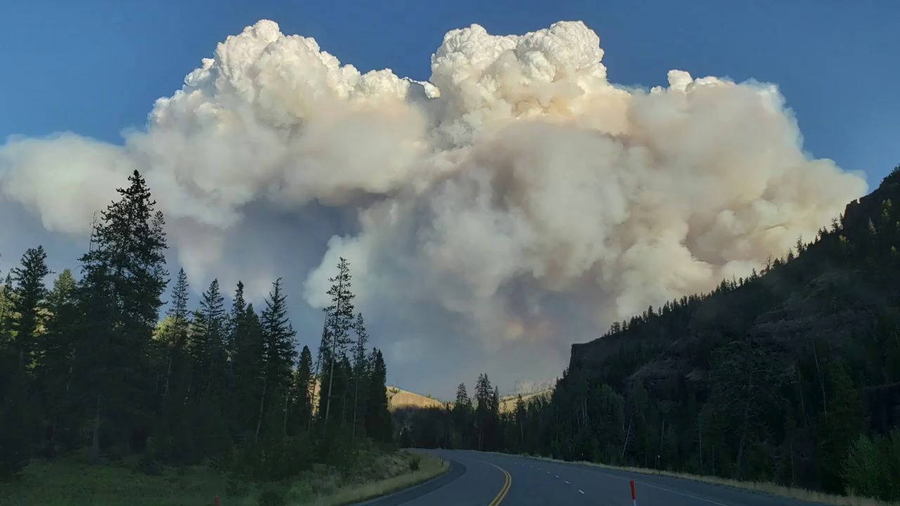
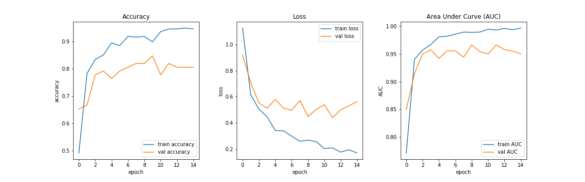

# Forest-Fire-Detection
CNN based Forest Fire Detection for camera equiped edge devices.

Dataset is created by extracting frames from YouTube videos. Instead of going for binay classification (fire vs non-fire), approaching the same as a multiclass classification since it has been observed that, model gets confused in some scenarios.

<h3>Cloud vs Fumes</h3>

<h3>Sunset vs Fire</h3>

Current dataset has following distribution.

| Class    | Examples |
|----------|:----------:|
| Cloud    | 110      |
| Fire     | 93       |
| Fumes    | 131      |
| Non-fire | 137      |

Problem can also be formulated as multi-label classification and will be tried very soon.

Todos:

- [X] Base notebooks for Keras and fastai+pytorch
- [X] Deployment pipeline for Raspberry Pi
- [ ] Implement Multilabel Classification
- [ ] Implement EfficientNet Models

These are the initial results by implementing simple transer learning with tensorflow keras.

| Model Name                                      | Accuracy |  AUC  | TFLite model size (MB) |
|-------------------------------------------------|:--------:|:-----:|:----------------------:|
| Inceptionv3-mixed-7-(Global Average + Max pool) |   77.42  |  90.5 |          11.52         |
| Inceptionv3-mixed-8-(Global Average + Max pool) |   73.12  | 91.83 |          10.8          |
| Inception-affine (Single top layer)             |   77.42  | 93.53 |          11.5          |
| Mobilenet-v2-affine (Single top layer)          |   86.02  | 95.77 |           2.3          |
| Resnet50-affine (Single Top layer)              |   82.80  | 97.04 |          23.6          |

Since mobilenetv2 has the lowest model size (tflite), current a raspberry pi implementation is using mobilenetv2. However, code is adaptable and can work with any other model with minimum changes. 

Mobilenet results:

Since the dataset is very small and not equally distributed, consider [Area Under the Curve(AUC)](https://en.wikipedia.org/wiki/Receiver_operating_characteristic) for ROC curve as the ideal measure to judge the performance.